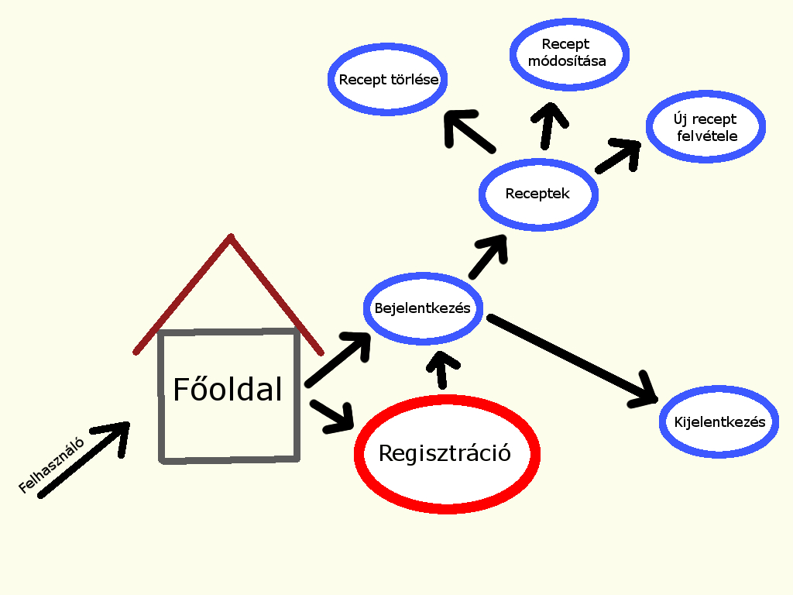
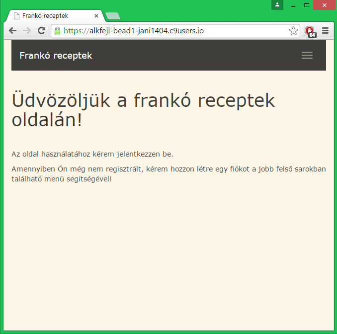
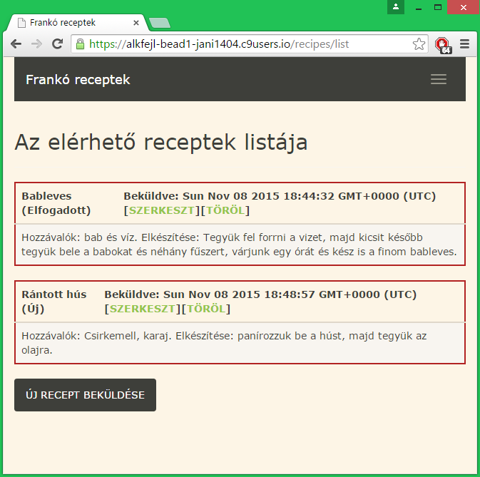
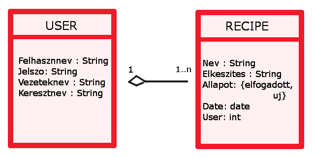

# Alkalmazások fejlesztése
ALKALMAZÁS: Receptek és hozzávalók 

NÉV: Balog János  
NEPTUN: QFYA09

## Követelmény feltárás
- legalább két modell, egy-sok kapcsolatban
- legalább 1 űrlap jelenléte
- legalább 1 listázó oldal
- legyen lehetőség új objektum felvételére
- legyen lehetőség meglévő szerkesztésére
- legyen lehetőség meglévő törlésére
- legyenek benne csak hitelesítés után elérhető funkciók
- perzisztálás fájlba történjen

### Használati eset modell
- A felhasználó a weboldalt megnyitva a főoldalon találja magát, ahol egy üdvözlő szöveg fogadja. A cím alatt segítséget kap abban, hogy hogyan kell használni az oldalt, illetve azt is megtudhatja, hol tud regisztrálni.
- Regisztráció, majd belépést követően a felhasználó láthatja a receptek listáját, illetve újat is tölthet fel, valamit törölhet és szerkeszthet meglévő recepteket.
- Minden receptnek van egy állapota, új felvitelkor ez az állapot "új" lesz és szerkesztéssel lehetőségünk van "elfogadott" állapotúra váltani.

### Nem funkcionális követelmények
Fejlesztési módszertan:
- Egységesített eljárás

A fejlesztéshez szükséges hardver:
- CPU: Pentium 4 (vagy annál újabb)
- RAM: 1 GB (vagy annál több)
- Felbontás: 1024x768

A fejlesztéshez használt szoftverek:
- Operációs rendszer: Ubuntu Linux 14.04.3 LTS
- Követelmény elemzés és fejlesztőeszköz: c9.io

A futtatáshoz szükséges szoftverek:
- Tetszőleges operációs rendszer, grafikus felülettel
- Javascript futtatására alkalmas böngésző (pl. Firefox)

A futtatáshoz szükséges minimum hardver:
- CPU: Pentium 4 (vagy annál újabb)
- - RAM: 512 MB
- Felbontás: 800x600

A futtatáshoz szükséges ajánlott hardver:
- CPU: Pentium 4 (vagy annál újabb)
- RAM: 2048 MB
- Felbontás: 1024x768

Egyéb követelmények:
- Interaktív felhasználói felület, könnyű kezelhetőség, egyértelműség 

## Tervezés
### Az Oldal felépítése

### Adatbázis

## Implementáció
### Fejlesztőeszközök
- cloud9.io webalkalmazás
- Node.JS

#### Alkalmazott csomagok
    - async
    - bcryptjs
    - waterline
    - body-parser
    - chai
    - connect-flash
    - passport-local
    - express
    - express-session
    - express-validator
    - hbs3.1.1
    - mocha
    - passport
    - zombie
    - sails-disk
    - sails-memory
    - shortid
    - socket.io
    

### Fejlesztői segédlet
- Node.JS szükséges az alkalmazás futtatáshoz!
- "npm install CSOMAGNÉV --save" parancs kiadásával telepíthetőek a fentebb felsorolt csomagok.
- Szerver indítása: "node server.js"

### Tesztelés
Tesztfájlok:
- test.js
- models/user.test.js

### Felhasználói dokumentáció
- Az oldalra regisztrálni kell a jobb felső sarokban található menü segítségével. 
- Az regisztráció során az adatokat (Vezetéknék, Keresztnév, Felhasználónév és Jelszó) kötelező kitölteni!
- Bejelentkezés után lehetőség nyílik receptek szerkesztésére, törlésére illetve új receptek felvitelére. 